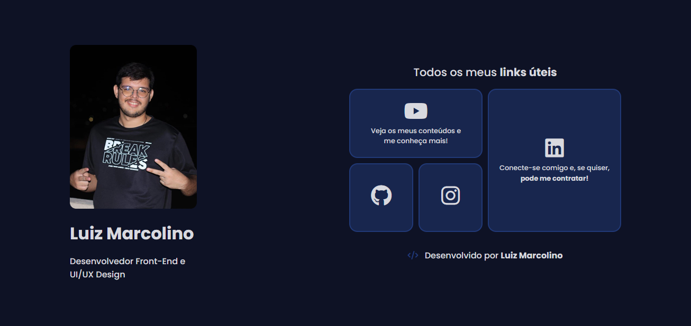

Este é um projeto simples e direto de uma **página de links** estilo bio, feito com **HTML5** e **CSS3**, focando em responsividade, identidade visual e boas práticas (tanto no design, quanto no desenvolvimento). A ideia é reunir meus links mais importantes em um layout bonito e funcional.

---

## Preview



[Clique para acessar a página](https://marcolino-developer-links.netlify.app)<br>
[Clique para acessar o antes (wireframe) e depois (design pronto)](https://imgur.com/a/Uuf6NbL)

---

## Estrutura do projeto 📁

```
/
├── index.html
├── README.md
└── src/
    ├── css/
    │   ├── global.css
    │   └── animacoes.css
    ├── images/
    │   ├── favicon.png
    │   └── img-luiz.png
```

---

## Tecnologias e ferramentas utilizadas

- **HTML5**
- **CSS3**
- **Figma**
- **Google Fonts**
- **Font Awesome** 

---

## Paleta de cores (CSS variables)

| Nome             | Valor                    |
|------------------|--------------------------|
| `--azul-escuro`  | `#0E1225`                | 
| `--azul-claro`   | `#213977`                |
| `--branco`       | `#D8D9DF`                | 
| `--hover`        | `rgba(51, 100, 227, 0.58)` | 
| `--background-card` | `rgba(33, 57, 119, 0.5)` | 
| `--sombra`       | `rgba(31, 32, 34, 0.39)` |

---

## Componentes principais

### 🔹 Bloco 1 - Perfil
Contém:
- Imagem do perfil
- Nome
- Minha profissão

### 🔹 Bloco 2 - Links
Layout em **grid** contendo:
- YouTube
- GitHub
- Instagram
- LinkedIn

---

## Responsividade

O layout se adapta a diferentes tamanhos de tela com **media queries**:

- **Mobile**: até `599px`
- **Tablet**: `600px` até `1024px`
- **Desktop**: acima de `1024px`

### Ajustes feitos:
- Redução de fontes
- Cards reorganizados
- Layout verticalizado no mobile

---

## Como rodar o projeto no seu computador

1. Clone o repositório:
   ```bash
   git clone https://github.com/seu-usuario/seu-repo.git
   ```

2. Abra o arquivo `index.html` com um navegador.

> **Dica**: você pode usar o Live Server do VS Code para ver as alterações em tempo real.

---

## 🧾 Licença

Este projeto é de uso livre para fins de aprendizado. Só não copia igualzinho sem dar os créditos, né? 😅

---
